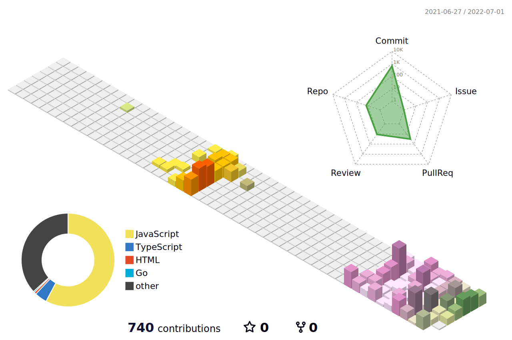

<!-- <h1></h1> -->
<!-- <h3 align="center">Hi, I'm Yumin Jung 🧑‍💻</h3> -->

<!-- <h4 align="center">Click My Coffee ☕️</h4>

  

 -->

<!--   -->

<!-- <h3 align="center">Tech Stack</h3> -->

<!-- 

  

 -->

<!-- <h3 align="center">Study Now</h3> -->

<!-- 

  

 -->

<!-- <h3 align="center">Contribution</h3>

 -->

<!-- 

  
  
  

 -->

<!--

 -->

</>