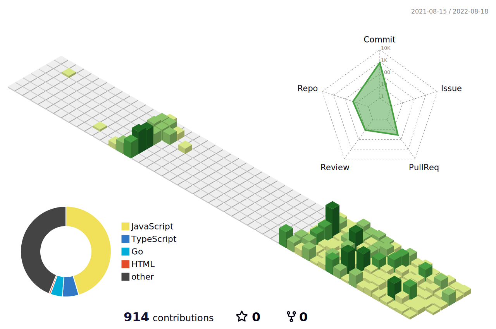

 

<h3 align="center">Hi, I'm Yumin Jung 👋</h3>

 

<h4 align="center">Click My Cat !!</h4>

  

 

<h3 align="center">Tech Stack</h3>

  

 

<h3 align="center">Study Now</h3>

  

 

<h3 align="center">Contribution</h3>

 

<h3 align="center">Blog</h3>

  

 

<h3 align="center">Have a Good Day 🙂</h3>

 
