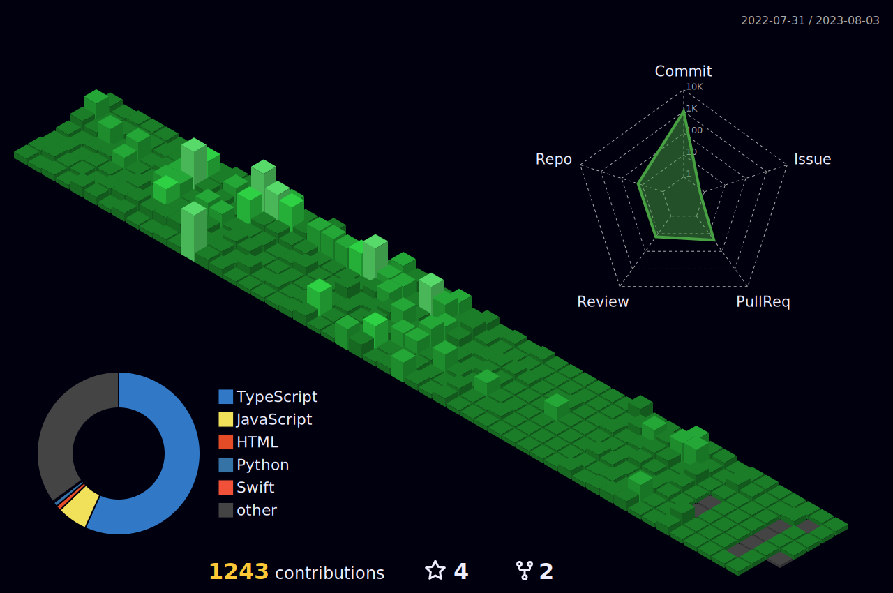

<h2 align="center">
Hi, I'm Yumin Jung 👋
</h2>

<h3 align="center">About Me</h3>

💻&ensp;College Student

🚀&ensp;Interested in FE / UX / DevOps

👟&ensp;Enjoy Running

<h3 align="center">Tech Stack</h3>

  

<h3 align="center">Study Now</h3>

  

<h3 align="center">Contribution</h3>

<h1></h1>

